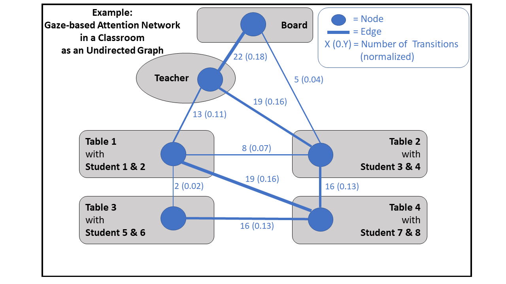

# Code for Creating Gaze-Based Attention Networks

File function libraries f1-f3

## f1 preprocessing

Preprocessing step for the VR datasets.

## f2 transition

Ref. to I.Aggregating raw gaze-target information into gaze transition datasets.
Ref to II. Creating gaze-based attention networks from gaze transition datasets.

## f3 Create Structural Variables

Ref. to III. Computing structural variables to describe gaze-based attention networks.

Examples of computing structural variables from an undirected graph. A scenario of gaze transitions in a classroom is shown with reduced complexity (fewer nodes) to create a gaze-based attention network of a participant.  

 

 

 

 

 

 