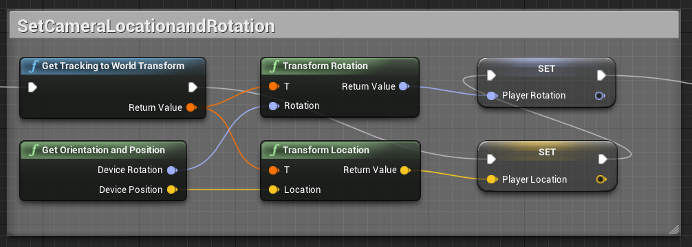

## I.	Enable eye-tracking in the Unreal Engine using the SRanipal SDK 
**Installation and Integration of SRanipal Eye Tracker**

- Setup Steam VR

- Install Steam https://store.steampowered.com/?l=english
- Inside the Steam Client install SteamVR

- Setup SRanipal
- Information for Sranipal Eye-Tracking is given by VIVE
	- https://developer.vive.com/resources/vive-sense/sdk/vive-eye-and-facial-tracking-sdk/

- Download and Install VIVE_SRanipalInstaller_1.3.2.0.msi (version might be different)

**Get started with the Unreal Engine**

- Install the Epic Game Launcher and register
- Go to library and Install Unreal Engine (maybe some troubles occur here, if so see: https://answers.unrealengine.com/questions/1035057/view.html)
- We used the Unreal Engine 4, Version 4.23.1 (individual costumisations are maybe necessary with another version) #Try Other Versions
- Start Unreal Engine and setup a new Project

- Install the SDK for Eye-Tracking
- Download SDK-v1.3.3.0.zip from https://hub.vive.com/en-US/download (version might be different)
- unpack SDK in prefered folder
- under C:\...\SDK\03_Unreal\Document\Eye\ you find a documentation to setup Eye-Tracking in Unreal ('Getting Started with SRanipal in Unreal Eye-v1.3.3.0.pdf')
- Quick steps: 
	- Copy Plugin Folder into your Unreal Project folder. 
	- Restart the editor and enable SRanipal ind Settings->Plugins
	- Under Project Settings -> Plugins -> SRanipal you can enable eye by default or put this Code into the BP 

Unreal Setup needed for VR projects:
https://docs.unrealengine.com/4.27/en-US/SharingAndReleasing/XRDevelopment/VR/VRPlatforms/SteamVR/QuickStart/

To be able to get access to the SDK Sranipal Eye Data we need to add something in the Environment build data file.
This file can be found in the Project (lets assume our new VR project is called VRTest): VRtest/Source/VRtest/Vrtest.Build.cs
Open file and add  "SRanipal", "SRanipalEye" to PublicDependencyModuleNames.AddRange(new string[] { "Core", "CoreUObject", "Engine", "InputCore", "SRanipal", "SRanipalEye" }).

Save and compile the project again. 

## II.	Create an eye-tracking Actor to provide and collect the eye-data: 

- Create a C++ Actor in your project called EyeTracker. Tow C++ files will be created in the Source folder of your Unreal project. 
- Copy the code from the two given files (EyeTracker.h & EyeTracker.cpp) into the respective newly created files.
- Modify the data collection pipeline in the script as you want  
- Go back to Unreal an create an "BP_EyeTracker" Blueprint from the C++ Actors.
- In the Blueprint create the following variables and functions to enable Gaze-Raycasting

## III.	Transform local gaze directions into global gaze directions:

- Align EyeTracker Actor with Pawn/Player, such that head orientation and head location are the same

- Get the forward vector of the player

- Calculate pitch and yaw from the local gaze vector

- Gaze is the variable created in the c++ script, which contains the local gaze vector tracked by the Tobii Eye Tracker (vector is updated by the script every tick).

- We created to nwe fuctions in the script to calculate pitch and yaw. The mathematical formula can be looked up in the paper. 

Get Pitch Rotation.

Get Yaw Rotation.

**Remarks on Tobii Eye-Tracking and Unreal Coordinate System**

Make sure that the right coordinates are used, because the Tobii Eye tracker and the Unreal Engine work with different coordinate systems and different rotations. 

*Tobii SDK Coordinate System*

Forward vector would be f1=[0,0,1]

*Unreal Enigne Coordinate System*

Forward vector would be f_=[1,0,0]

 

*Pictures from:* [https://vr.tobii.com/sdk/media/learn/technical-information/world-tracking-space.png](https://vr.tobii.com/sdk/media/learn/technical-information/world-tracking-space.png) (left), [http://www.aclockworkberry.com/world-coordinate-systems-in-3ds-max-unity-and-unreal-engine/](http://www.aclockworkberry.com/world-coordinate-systems-in-3ds-max-unity-and-unreal-engine/) (right)

## IV.	Project the global gaze vector into the environment by using the raycasting function: 

## V.	Collect gaze target information in the eye-tracking Actor and save in datafile: 

