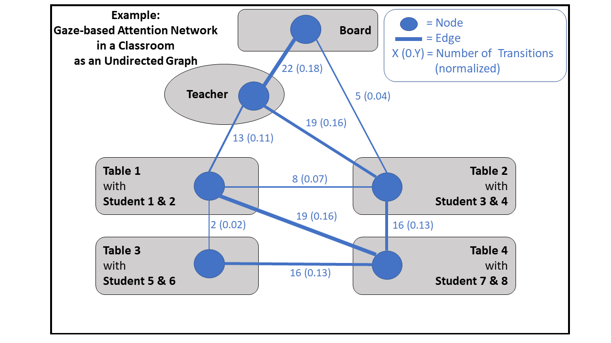
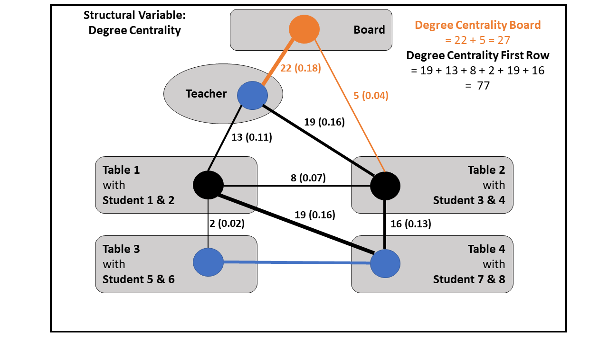
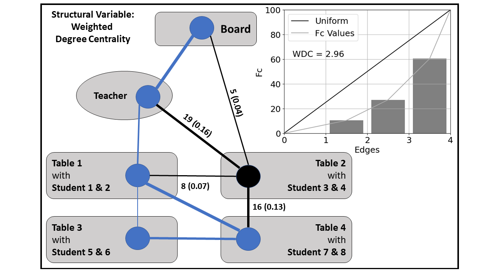
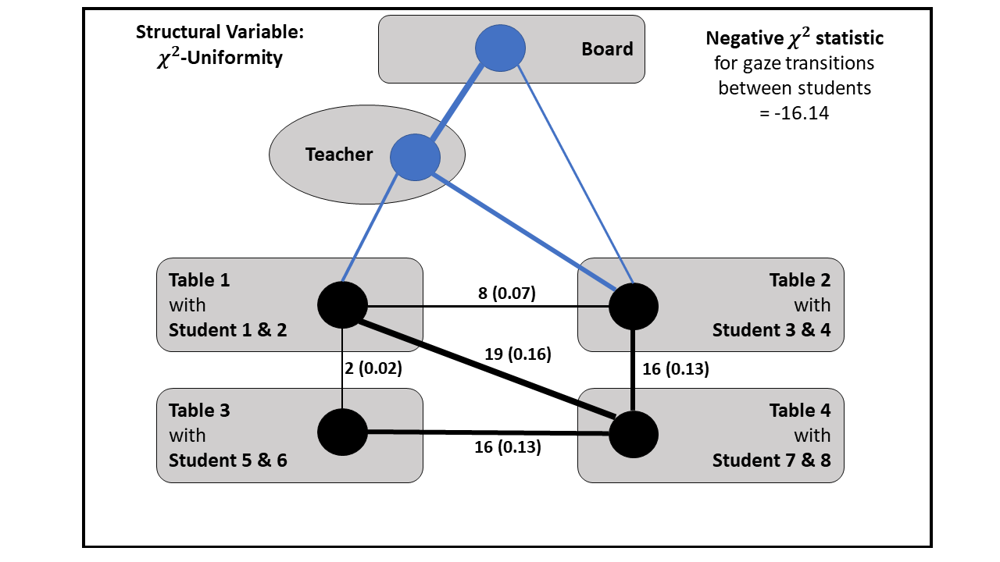
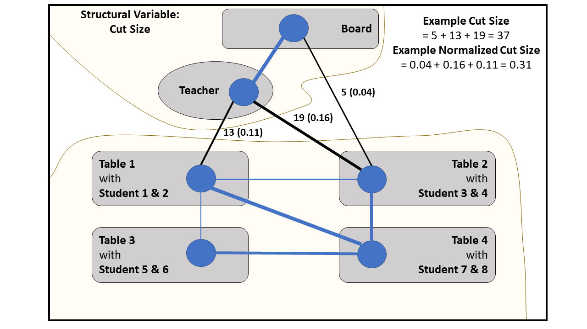
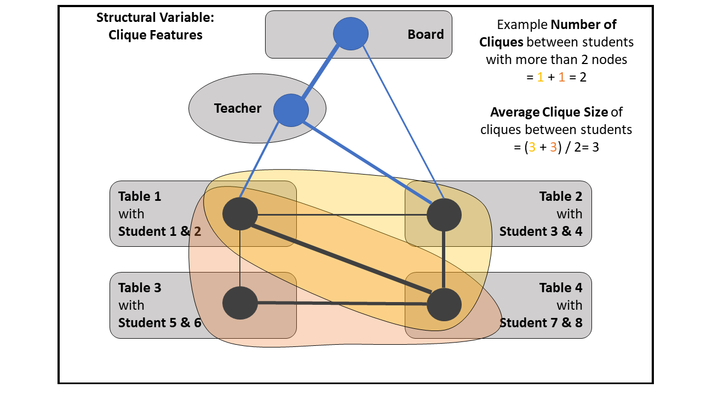

# Code for Creating Gaze-Based Attetion Networks

File function libraries f1-f3

## f3 Create Structural Variables

Examples of computing structural variables from an undirected graph. A scenario of gaze transitions in a classroom is shown with reduced complexity (fewer nodes) to create a gaze-based attention network of a participant.  

 

 

 

 

 

 